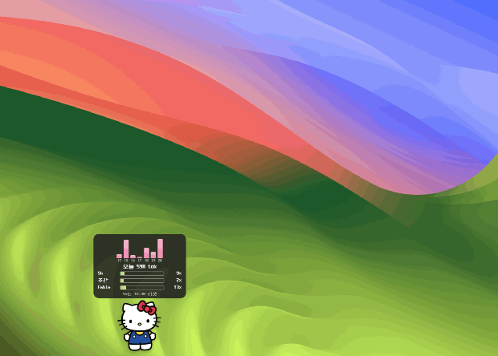

# my-claude-pets 🐾

<p align="center">
  
</p>

Desktop pets for people who live in [Claude Code](https://claude.com/claude-code).

Your pets roam along the bottom of **all your monitors**, carry a live
**Claude token budget graph** over their heads, and when you click one, a
retro game-style search panel pops up — type a project name, hit Enter, and
iTerm opens right in that project with `claude` already running.

> macOS + [iTerm2](https://iterm2.com/) only (for now). The token HUD reads
> your local Claude Code transcripts, plus (optionally) Anthropic's official
> usage endpoint — the same call Claude Code's `/usage` makes, using your own
> locally stored login. Nothing else ever leaves your machine.

## Features

- **Wandering pets** — pixel-style pets walk along the bottom of the screen,
  pause, breathe, and cross over to neighboring displays when they hit a
  screen edge. Windows are fully click-through except on the pets themselves.
- **Pick them up** — drag a pet anywhere (even to another monitor, the drag
  follows your cursor across displays). Drop it in mid-air and it stays there;
  drop it near the floor and it walks off again.
- **Token budget HUD** — a 7-day usage bar chart plus your **official plan
  usage**: the same percentages Claude Code's `/usage` shows (5-hour session,
  weekly all-models, weekly per-model) with the session reset time, as a live
  gauge that turns red past 85%. Refreshed every 2 minutes. If you're not
  logged in (or set `"officialQuota": false`), it falls back to a local
  estimate from your transcripts.
- **Project launcher** — click a pet, fuzzy-search every project folder under
  your configured roots, press Enter. If iTerm is already running you choose
  **new tab** or **new window**; otherwise a window opens directly. The
  terminal starts in the project directory and runs your command
  (default: `claude`).
- **Self-healing** — a watchdog re-spawns a pet within 30 seconds if it ever
  gets lost in a display hand-off, and display plug/unplug is handled
  automatically.

## Install

**The lazy way** — you already live in Claude Code, so let it do the work.
Paste this into any Claude Code session:

```
Clone https://github.com/CordeliaSun/my-claude-pets, install dependencies, and start it
```

**The manual way**:

```bash
git clone https://github.com/CordeliaSun/my-claude-pets.git
cd my-claude-pets
npm install
npm start
```

On first launch a `pets.json` is created from `pets.example.json`, the
bundled mascot (an original bow-wearing cat, `images/mascot.svg`) starts
walking along the bottom of your screen, and a 🐾 icon appears in the menu
bar (reload config / quit live there).

## Configuration (`pets.json`)

```jsonc
{
  // folders scanned (one level deep) by the project search panel
  "searchRoots": ["~/Desktop", "~/Documents", "~/Developer", "~/Projects"],

  // command run in the terminal for projects opened via search
  "defaultCommand": "claude",

  // set to false to skip the official plan-usage lookup (see below)
  "officialQuota": true,

  "pets": [
    {
      "name": "my-pet",              // required — label + identity
      "project": "~/Desktop",        // required — this pet's home project
      "image": "./images/cat.png",   // optional — transparent PNG; emoji fallback
      "emoji": "🐱",                 // optional — used when no image is set
      "scale": 1,                    // optional — pet size multiplier
      "speed": 1,                    // optional — walking speed multiplier
      "command": "claude"            // optional — per-pet terminal command
    }
  ]
}
```

### Default mascot


Out of the box your pet is this original bow-wearing cat
(`images/mascot.svg`). Remove the `image` field to fall back to the
`emoji` instead, or bring your own character below.

<br clear="left" />

### Use your own character

1. Get any image with a **transparent background** (PNG or SVG, roughly
   square looks best).
2. Drop it into `images/` — e.g. `images/mario.png`.
3. Point your pet at it in `pets.json`:

   ```json
   { "name": "mario", "project": "~/Projects/game", "image": "./images/mario.png", "scale": 1.3 }
   ```

4. Menu bar 🐾 → **reload config**. Done — no restart needed.

Paths can also be absolute or start with `~` (e.g.
`"image": "~/Pictures/my-cat.png"`), so you don't have to copy files into
the repo. `pets.json` and everything you add to `images/` are gitignored —
your customizations stay local. If the image path is missing, the pet
falls back to its `emoji`. Use `scale` to size your character.

## How the token numbers work

**Official plan percentages** (the gauge and `5h 9% · 주간 7% · Fable 13%`
lines) come from Anthropic's usage endpoint — the exact same numbers Claude
Code's `/usage` screen shows. The app reads the OAuth token Claude Code
already stores on your machine (macOS Keychain, falling back to
`~/.claude/.credentials.json`) and makes one HTTPS request to
`api.anthropic.com` every 2 minutes. That is the app's **only** network
call; the token is never written anywhere or sent anywhere else. Opt out
with `"officialQuota": false` in `pets.json`.

**Local token counts** (today + the 7-day bar chart) are aggregated from the
transcripts (JSONL with per-message usage) Claude Code writes under
`~/.claude/projects/` — input + output + cache read/write, deduplicated by
message id, fully offline.

If official percentages aren't available (not logged in, offline, or opted
out), the 5h gauge falls back to a local estimate: usage grouped into
5-hour blocks (first activity floored to the hour, matching
[ccusage](https://github.com/ryoppippi/ccusage)'s model) against your
largest historical block as the assumed limit.

## Tests

```bash
npm test
```

## Credits

- Retro Korean pixel font: [Neo둥근모 (NeoDunggeunmo)](https://github.com/neodgm/neodgm)
  — public domain, bundled in `fonts/`.
- 5-hour block model inspired by [ccusage](https://github.com/ryoppippi/ccusage).

## License

[MIT](./LICENSE)
